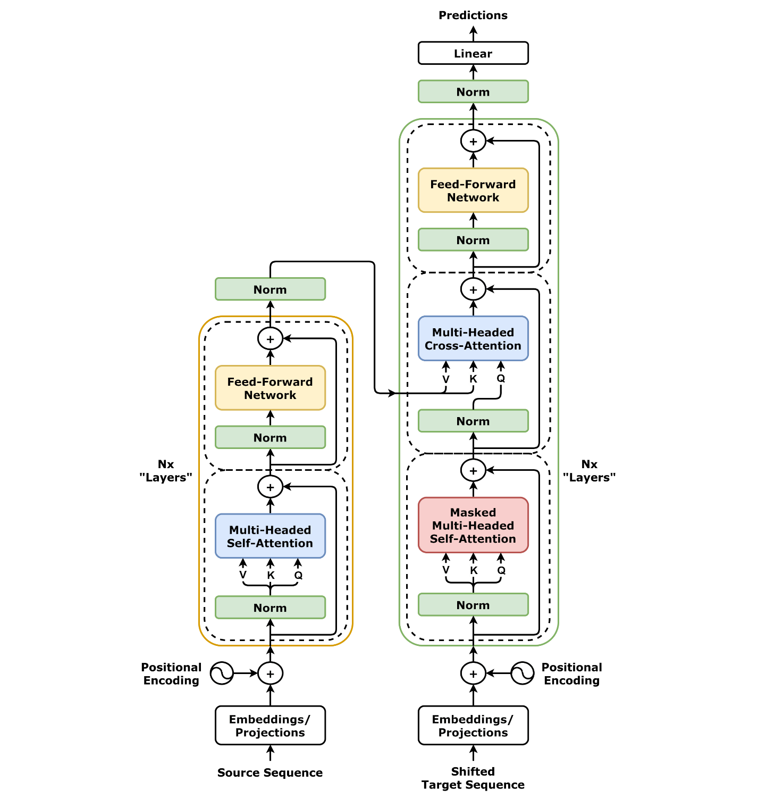

# LLM

## 概述

大语言模型 (Large Language Model, LLM) 是基于 Transformer 架构的深度学习模型，通过大规模文本数据训练，能够理解和生成人类语言。

## 预训练 (Pre-training)

### 目标
让模型学习通用的表示和世界的知识；使用海量、无标注的文本数据，通过自监督的方式学习。

### 训练数据
- **规模**：通常使用数万亿个 token 的文本数据
- **来源**：网页、书籍、新闻、代码、对话等
- **语言**：多语言混合，以英语为主

### 预训练任务

#### 1. 自回归语言建模 (Autoregressive LM)
```python
# GPT 系列使用的方法
# 给定前面的词，预测下一个词
输入: "今天天气很"
输出: "好" (概率最高)
```

#### 2. 掩码语言建模 (Masked LM)
```python
# BERT 系列使用的方法
# 预测被掩码的词
输入: "今天天气很[MASK]"
输出: "好" (概率最高)
```

#### 3. 序列到序列 (Seq2Seq)
```python
# T5 系列使用的方法
# 将各种任务转换为文本到文本的格式
输入: "翻译：Hello world"
输出: "你好世界"
```

### 预训练阶段的特点
- **无监督学习**：不需要人工标注
- **大规模数据**：TB 级别的文本数据
- **长时间训练**：通常需要数周到数月
- **通用能力**：获得广泛的语言理解能力

## 后训练 (Post-training)

在基础模型上进一步训练，使得模型更安全、更可控、更擅长某个特定的领域。

### 后训练的目标
1. **安全性**：减少有害内容生成
2. **可控性**：更好地遵循指令
3. **专业性**：在特定领域表现更好
4. **对齐性**：与人类价值观对齐

### 微调 (Fine-tuning)

#### 1. 监督微调 (Supervised Fine-tuning, SFT)

使用标注的指令-回答对进行训练

**特点：**
- 使用高质量的指令-回答对
- 通常需要 1K-100K 样本
- 训练时间相对较短
- 显著提升指令遵循能力

#### 2. LoRA (Low-Rank Adaptation)
```python
# 只训练低秩矩阵，不改变原始参数
原始权重: W (d × k)
LoRA权重: A (d × r) × B (r × k), r << min(d,k)
最终权重: W + A × B
```

**优势：**
- 参数量大幅减少 (1-10%)
- 训练速度快
- 可以保存多个任务适配器
- 内存需求低

### 强化学习 (Reinforcement Learning)

```python
# Q-Learning 基于 Bellman 最优方程
# Q*(s, a) = E[R + γ * max_a' Q*(s', a') | s, a]

# 更新规则：
# Q(s, a) ← Q(s, a) + α[R + γ * max_a' Q(s', a') - Q(s, a)]
# 其中：
# α: 学习率
# γ: 折扣因子
# R: 即时奖励
```

```python
def q_learning_step(self, state, action, reward, next_state, done):
    """
    Q-Learning 更新步骤
    """
    # 当前 Q 值
    current_q = self.q_table[state, action]
    
    if done:
        # 如果是终止状态，没有未来奖励
        target_q = reward
    else:
        # 使用贪心策略选择下一动作
        next_action = np.argmax(self.q_table[next_state, :])
        # 目标 Q 值：当前奖励 + 折扣后的最大未来奖励
        target_q = reward + self.gamma * self.q_table[next_state, next_action]
    
    # Q 值更新
    self.q_table[state, action] = current_q + self.learning_rate * (target_q - current_q)
```

## Transformer 架构详解

### 1. 整体架构

Transformer 由 Encoder 和 Decoder 两个部分组成，每个部分都包含多个相同的层。



```python
class Transformer:
    def __init__(self, d_model, n_heads, n_layers, vocab_size):
        self.embedding = Embedding(vocab_size, d_model)
        self.pos_encoding = PositionalEncoding(d_model)
        self.encoder = Encoder(d_model, n_heads, n_layers)
        self.decoder = Decoder(d_model, n_heads, n_layers)
        self.output_projection = Linear(d_model, vocab_size)
    
    def forward(self, src, tgt):
        # 编码器
        src_emb = self.embedding(src) + self.pos_encoding(src)
        encoder_output = self.encoder(src_emb)
        
        # 解码器
        tgt_emb = self.embedding(tgt) + self.pos_encoding(tgt)
        decoder_output = self.decoder(tgt_emb, encoder_output)
        
        # 输出投影
        output = self.output_projection(decoder_output)
        return output
```

### 2. 核心组件详解

#### 2.1 自注意力机制 (Self-Attention)

自注意力是 Transformer 的核心，允许序列中的每个位置都能关注到序列中的所有位置。

```python
class MultiHeadAttention:
    def __init__(self, d_model, n_heads):
        self.d_model = d_model
        self.n_heads = n_heads
        self.d_k = d_model // n_heads
        
        self.W_q = Linear(d_model, d_model)
        self.W_k = Linear(d_model, d_model)
        self.W_v = Linear(d_model, d_model)
        self.W_o = Linear(d_model, d_model)
    
    def forward(self, query, key, value, mask=None):
        batch_size = query.size(0)
        
        # 1. 线性变换并分割成多头
        Q = self.W_q(query).view(batch_size, -1, self.n_heads, self.d_k).transpose(1, 2)
        K = self.W_k(key).view(batch_size, -1, self.n_heads, self.d_k).transpose(1, 2)
        V = self.W_v(value).view(batch_size, -1, self.n_heads, self.d_k).transpose(1, 2)
        
        # 2. 计算注意力
        attention_output = self.scaled_dot_product_attention(Q, K, V, mask)
        
        # 3. 合并多头
        attention_output = attention_output.transpose(1, 2).contiguous().view(
            batch_size, -1, self.d_model
        )
        
        # 4. 最终线性变换
        output = self.W_o(attention_output)
        return output
    
    def scaled_dot_product_attention(self, Q, K, V, mask=None):
        # 计算注意力分数
        scores = torch.matmul(Q, K.transpose(-2, -1)) / math.sqrt(self.d_k)
        
        # 应用掩码
        if mask is not None:
            scores = scores.masked_fill(mask == 0, -1e9)
        
        # Softmax 归一化
        attention_weights = F.softmax(scores, dim=-1)
        
        # 加权求和
        output = torch.matmul(attention_weights, V)
        return output
```

#### 2.2 位置编码 (Positional Encoding)

由于 Transformer 没有循环结构，需要位置编码来提供序列位置信息。

```python
class PositionalEncoding:
    def __init__(self, d_model, max_len=5000):
        self.d_model = d_model
        
        # 创建位置编码矩阵
        pe = torch.zeros(max_len, d_model)
        position = torch.arange(0, max_len).unsqueeze(1).float()
        
        # 计算位置编码
        div_term = torch.exp(torch.arange(0, d_model, 2).float() * 
                           -(math.log(10000.0) / d_model))
        
        pe[:, 0::2] = torch.sin(position * div_term)
        pe[:, 1::2] = torch.cos(position * div_term)
        
        self.register_buffer('pe', pe.unsqueeze(0))
    
    def forward(self, x):
        return x + self.pe[:, :x.size(1)]
```

#### 2.3 前馈网络 (Feed-Forward Network)

每个 Transformer 层都包含一个前馈网络，对每个位置独立应用相同的变换。

```python
class FeedForward:
    def __init__(self, d_model, d_ff):
        self.linear1 = Linear(d_model, d_ff)
        self.linear2 = Linear(d_ff, d_model)
        self.dropout = Dropout(0.1)
    
    def forward(self, x):
        return self.linear2(self.dropout(F.relu(self.linear1(x))))
```

#### 2.4 残差连接和层归一化

```python
class TransformerBlock:
    def __init__(self, d_model, n_heads, d_ff, dropout=0.1):
        self.attention = MultiHeadAttention(d_model, n_heads)
        self.feed_forward = FeedForward(d_model, d_ff)
        self.norm1 = LayerNorm(d_model)
        self.norm2 = LayerNorm(d_model)
        self.dropout = Dropout(dropout)
    
    def forward(self, x, mask=None):
        # 自注意力 + 残差连接 + 层归一化
        attn_output = self.attention(x, x, x, mask)
        x = self.norm1(x + self.dropout(attn_output))
        
        # 前馈网络 + 残差连接 + 层归一化
        ff_output = self.feed_forward(x)
        x = self.norm2(x + self.dropout(ff_output))
        
        return x
```

### 3. 注意力机制详解

#### 3.1 注意力计算过程

```python
# 注意力机制的数学表示
# Attention(Q, K, V) = softmax(QK^T / √d_k)V

def attention_mechanism(Q, K, V, mask=None):
    # Q: 查询矩阵 (batch_size, n_heads, seq_len, d_k)
    # K: 键矩阵 (batch_size, n_heads, seq_len, d_k)
    # V: 值矩阵 (batch_size, n_heads, seq_len, d_v)
    
    # 1. 计算注意力分数
    scores = torch.matmul(Q, K.transpose(-2, -1))
    
    # 2. 缩放 (防止梯度消失)
    scores = scores / math.sqrt(Q.size(-1))
    
    # 3. 应用掩码 (可选)
    if mask is not None:
        scores = scores.masked_fill(mask == 0, -1e9)
    
    # 4. Softmax 归一化
    attention_weights = F.softmax(scores, dim=-1)
    
    # 5. 加权求和
    output = torch.matmul(attention_weights, V)
    
    return output, attention_weights
```

#### 3.2 多头注意力的优势

```python
# 多头注意力允许模型同时关注不同位置的不同表示子空间
# 每个头可以学习不同的注意力模式

class MultiHeadAttention:
    def __init__(self, d_model, n_heads):
        assert d_model % n_heads == 0
        
        self.d_model = d_model
        self.n_heads = n_heads
        self.d_k = d_model // n_heads
        
        # 为每个头创建独立的线性变换
        self.W_q = Linear(d_model, d_model)
        self.W_k = Linear(d_model, d_model)
        self.W_v = Linear(d_model, d_model)
        self.W_o = Linear(d_model, d_model)
    
    def forward(self, query, key, value, mask=None):
        batch_size = query.size(0)
        
        # 分割成多个头
        Q = self.W_q(query).view(batch_size, -1, self.n_heads, self.d_k)
        K = self.W_k(key).view(batch_size, -1, self.n_heads, self.d_k)
        V = self.W_v(value).view(batch_size, -1, self.n_heads, self.d_k)
        
        # 转置以便计算注意力
        Q = Q.transpose(1, 2)  # (batch_size, n_heads, seq_len, d_k)
        K = K.transpose(1, 2)
        V = V.transpose(1, 2)
        
        # 计算注意力
        attention_output, attention_weights = self.scaled_dot_product_attention(
            Q, K, V, mask
        )
        
        # 合并多头
        attention_output = attention_output.transpose(1, 2).contiguous().view(
            batch_size, -1, self.d_model
        )
        
        # 最终线性变换
        output = self.W_o(attention_output)
        return output
```

### 4. 编码器 (Encoder)

编码器由多个相同的层组成，每层包含自注意力机制和前馈网络。

```python
class Encoder:
    def __init__(self, d_model, n_heads, n_layers, d_ff):
        self.layers = nn.ModuleList([
            TransformerBlock(d_model, n_heads, d_ff)
            for _ in range(n_layers)
        ])
    
    def forward(self, x, mask=None):
        for layer in self.layers:
            x = layer(x, mask)
        return x
```

### 5. 解码器 (Decoder)

解码器也由多个相同的层组成，但每层包含三个子层：
1. 掩码自注意力
2. 编码器-解码器注意力
3. 前馈网络

```python
class DecoderBlock:
    def __init__(self, d_model, n_heads, d_ff, dropout=0.1):
        self.self_attention = MultiHeadAttention(d_model, n_heads)
        self.cross_attention = MultiHeadAttention(d_model, n_heads)
        self.feed_forward = FeedForward(d_model, d_ff)
        
        self.norm1 = LayerNorm(d_model)
        self.norm2 = LayerNorm(d_model)
        self.norm3 = LayerNorm(d_model)
        
        self.dropout = Dropout(dropout)
    
    def forward(self, x, encoder_output, src_mask=None, tgt_mask=None):
        # 1. 掩码自注意力
        self_attn_output = self.self_attention(x, x, x, tgt_mask)
        x = self.norm1(x + self.dropout(self_attn_output))
        
        # 2. 编码器-解码器注意力
        cross_attn_output = self.cross_attention(x, encoder_output, encoder_output, src_mask)
        x = self.norm2(x + self.dropout(cross_attn_output))
        
        # 3. 前馈网络
        ff_output = self.feed_forward(x)
        x = self.norm3(x + self.dropout(ff_output))
        
        return x
```

### 主要变体

#### 1. GPT 系列 (Decoder-only)
- **特点**：自回归生成
- **代表**：GPT-3, GPT-4, ChatGPT
- **优势**：生成质量高，推理能力强

#### 2. BERT 系列 (Encoder-only)
- **特点**：双向编码
- **代表**：BERT, RoBERTa, DeBERTa
- **优势**：理解能力强，适合分类任务

#### 3. T5 系列 (Encoder-Decoder)
- **特点**：统一文本到文本框架
- **代表**：T5, UL2, PaLM
- **优势**：任务泛化能力强

## 训练技术

### 数据预处理
```python
# 文本清洗和标准化
def preprocess_text(text):
    # 1. 去除非文本内容
    text = re.sub(r'<[^>]+>', '', text)
    
    # 2. 统一编码
    text = text.encode('utf-8').decode('utf-8')
    
    # 3. 标准化空白字符
    text = re.sub(r'\s+', ' ', text)
    
    return text.strip()
```

### 分词 (Tokenization)
```python
# 常见分词方法
# 1. BPE (Byte Pair Encoding) - GPT 系列
# 2. WordPiece - BERT 系列  
# 3. SentencePiece - T5 系列

# 示例：BPE 分词
tokens = tokenizer.encode("Hello world!")
# 输出: [15496, 995, 0] (token IDs)
```

## 未来发展方向

### 1. 多模态能力
- 图像理解
- 音频处理
- 视频分析

### 2. 推理能力提升
- 数学推理
- 逻辑推理
- 常识推理

### 3. 效率优化
- 模型压缩
- 推理加速
- 能耗降低

### 4. 专业化发展
- 领域特定模型
- 任务特化
- 个性化定制