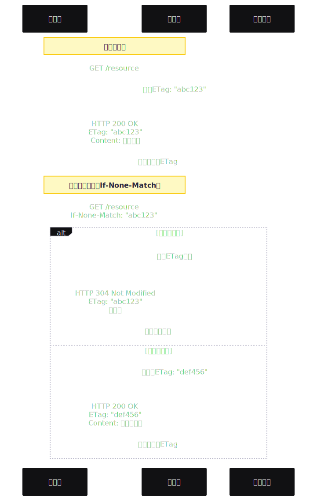
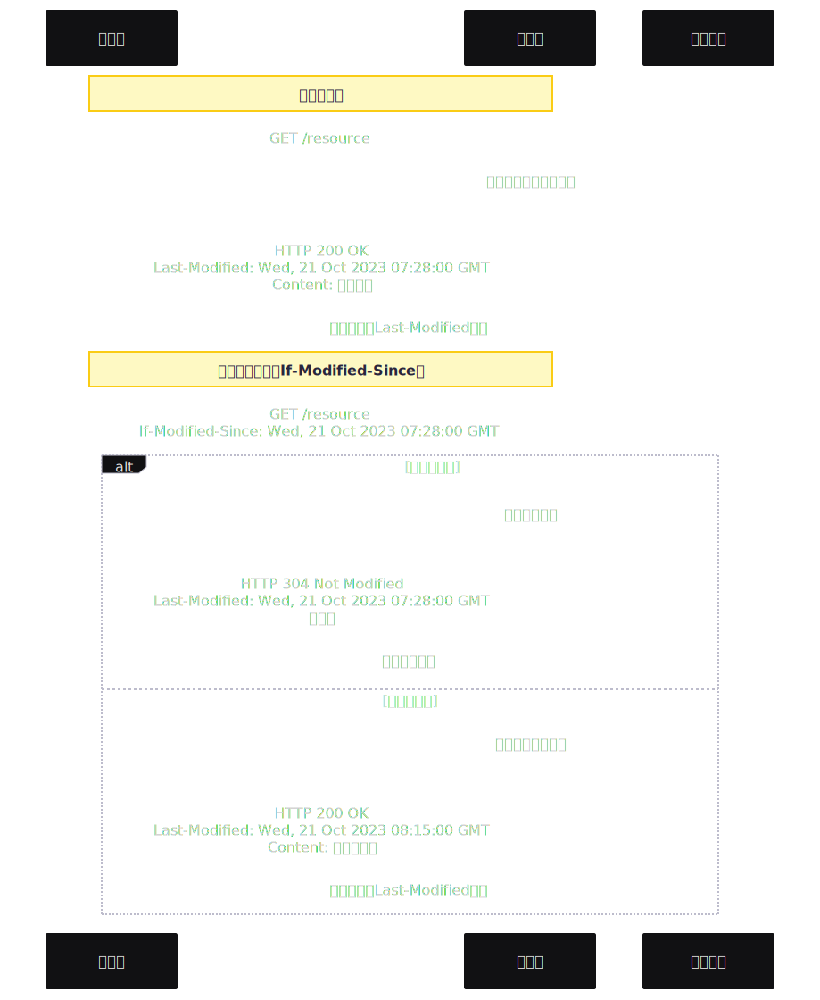
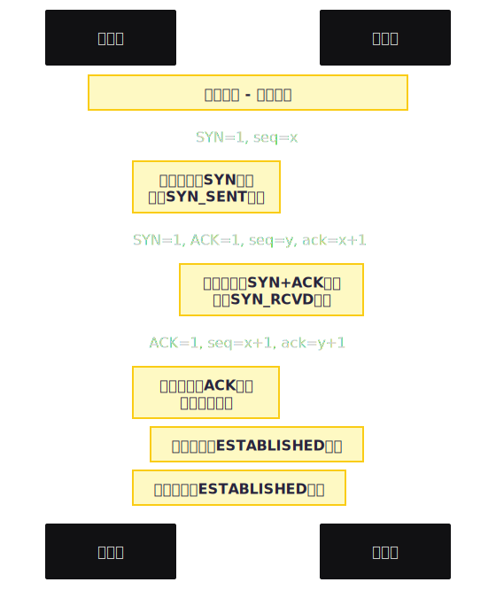
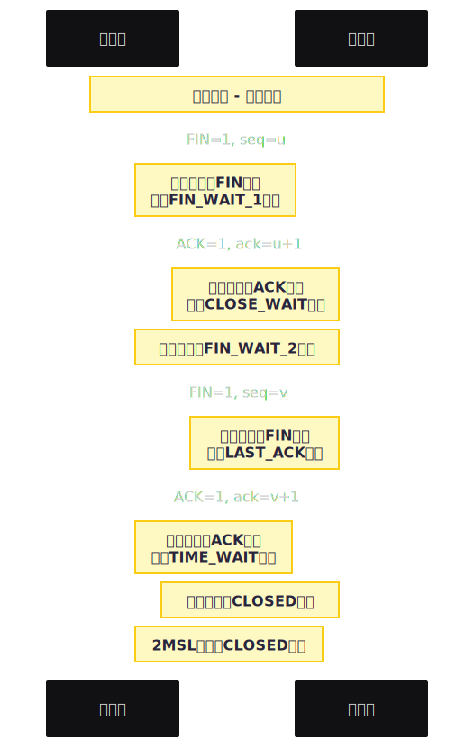

# 浏览器

## Browser

1. 检查强缓存
2. DNS解析
3. TCP链接
4. HTTP请求
5. 服务器处理
6. 返回响应
7. 检查协商缓存
8. 解析HTML
9. DOM & CSSDOM
10. 执行JavaScript
11. 渲染页面

## 判断缓存

### 强缓存

Expires Cache-Control：直接读缓存，返回 200

- Expires：过期绝对时间

- Cache-Control：

| max-age | 资源被缓存的时间，单位秒 |
| --- | --- |
| s-maxage | 同max-age，针对代理服务器 |
| public | 响应可任何和缓存区缓存（服务器和中间服务器） |
| private | 只针对个人，不能被代理缓存 |
| no-cache | 强制向服务器发送请求，服务器评估返回304还是其他 |
| no-store | 禁止一切缓存 |

### 协商缓存

- If-None-Match: Etag 304
- If-Modified-Since: Last-Modified 304

- If-None-Match：携带Etag向服务器请求，判断是否可以被缓存
    


<!-- ```mermaid
sequenceDiagram
    participant Client as 客户端
    participant Server as 服务器
    participant Cache as 本地缓存
    Note over Client,Server: 第一次请求
    Client->>Server: GET /resource
    Server->>Server: 生成ETag: "abc123"
    Server->>Client: HTTP 200 OK<br/>ETag: "abc123"<br/>Content: 资源内容
    Client->>Cache: 存储资源和ETag
    Note over Client,Server: 后续请求（使用If-None-Match）
    Client->>Server: GET /resource<br/>If-None-Match: "abc123"
    alt 资源未修改
        Server->>Server: 检查ETag匹配
        Server->>Client: HTTP 304 Not Modified<br/>ETag: "abc123"<br/>无内容
        Client->>Cache: 使用缓存内容
    else 资源已修改
        Server->>Server: 生成新ETag: "def456"
        Server->>Client: HTTP 200 OK<br/>ETag: "def456"<br/>Content: 新资源内容
        Client->>Cache: 更新缓存和ETag
    end
``` -->
    
- If-Modified-Since：携带Last-Modified向服务器请求，判断是否可以被缓存


    
<!-- ```mermaid
sequenceDiagram
		participant Client as 客户端
		participant Server as 服务器
		participant Cache as 本地缓存

		Note over Client,Server: 第一次请求
		Client->>Server: GET /resource
		Server->>Server: 获取资源最后修改时间
		Server->>Client: HTTP 200 OK<br/>Last-Modified: Wed, 21 Oct 2023 07:28:00 GMT<br/>Content: 资源内容
		Client->>Cache: 存储资源和Last-Modified时间

		Note over Client,Server: 后续请求（使用If-Modified-Since）
		Client->>Server: GET /resource<br/>If-Modified-Since: Wed, 21 Oct 2023 07:28:00 GMT
		
		alt 资源未修改
				Server->>Server: 检查修改时间
				Server->>Client: HTTP 304 Not Modified<br/>Last-Modified: Wed, 21 Oct 2023 07:28:00 GMT<br/>无内容
				Client->>Cache: 使用缓存内容
		else 资源已修改
				Server->>Server: 获取新的修改时间
				Server->>Client: HTTP 200 OK<br/>Last-Modified: Wed, 21 Oct 2023 08:15:00 GMT<br/>Content: 新资源内容
				Client->>Cache: 更新缓存和Last-Modified时间
		end
``` -->
    

### 缓存位置

- 优先 memory cache：速度快
- 然后 disk cache：速度慢
- service worker
- http2 新增 push cache：上三个都没命中，只存在 session

## DNS解析

- 递归查询：本地域名服务器→根服务器.com→顶级域名dns.com→权限域名dns.abc.com
- 迭代查询：由本地域名服务器一个一个查

## 获取IP地址

## HTTP链接

- Client → Server：能听见我吗（SYN）

- Client ← Server：可以听见（ACK），能听见我吗（SYN）

- Client → Server：可以听见（ACK）



<!-- ```mermaid
sequenceDiagram
    participant Client as 客户端
    participant Server as 服务器
    
    Note over Client,Server: 三次握手 - 建立连接
    
    Client->>Server: SYN=1, seq=x
    Note right of Client: 客户端发送SYN包，<br/>进入SYN_SENT状态
    
    Server->>Client: SYN=1, ACK=1, seq=y, ack=x+1
    Note left of Server: 服务器发送SYN+ACK包，<br/>进入SYN_RCVD状态
    
    Client->>Server: ACK=1, seq=x+1, ack=y+1
    Note right of Client: 客户端发送ACK包，<br/>连接建立完成
    Note left of Server: 服务器进入ESTABLISHED状态
    Note right of Client: 客户端进入ESTABLISHED状态
``` -->

## 响应状态码

## 断开链接

- Client → Server：我要走了，再见（FIN）。

- Client ← Server：收到（ACK）

- Client ← Server：我也要走了，再见（FIN）

- Client → Server：收到（ACK）

可优化为3次：服务器没有额外信息可以合并 ACK+FIN



<!-- ```mermaid
sequenceDiagram
    participant Client as 客户端
    participant Server as 服务器
    
    Note over Client,Server: 四次挥手 - 断开连接
    
    Client->>Server: FIN=1, seq=u
    Note right of Client: 客户端发送FIN包，<br/>进入FIN_WAIT_1状态
    
    Server->>Client: ACK=1, ack=u+1
    Note left of Server: 服务器发送ACK包，<br/>进入CLOSE_WAIT状态
    Note right of Client: 客户端进入FIN_WAIT_2状态
    
    Server->>Client: FIN=1, seq=v
    Note left of Server: 服务器发送FIN包，<br/>进入LAST_ACK状态
    
    Client->>Server: ACK=1, ack=v+1
    Note right of Client: 客户端发送ACK包，<br/>进入TIME_WAIT状态
    Note left of Server: 服务器进入CLOSED状态
    Note right of Client: 2MSL后进入CLOSED状态
``` -->

## 解析HTML

## 并行DOM和CSSDOM

## 合并渲染树

## 执行JavaScritp

HTML解析 → 遇到`<script>`标签 → 停止HTML解析 

→ 下载JS → 解析JS → 执行JS → 继续HTML解析
1. `<script>` - 默认行为，同步阻塞
2. `<script async>` - 异步下载，执行阻塞
3. `<script defer>` - 异步下载，DOM解析完，顺序执行

## 渲染

### 1. 重排

重新计算位置和组合形状

### 2. 重绘

通常紧跟在重排之后，UI引起的视觉更新，如颜色

### 3. 阻塞

CSS阻塞渲染，不阻塞解析；JS阻塞解析和渲染

async：script 并行下载 ，加载完立即执行（可能阻塞渲染）

defer：dom 解析时并行下载，dom 构建完再执行，保持相对顺序