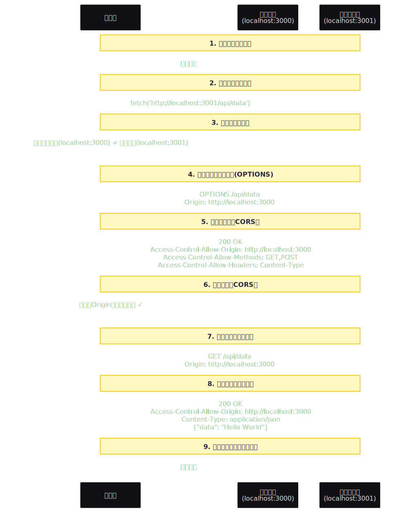

# 网络安全

# **Security**

## 跨域

同源策略：域名、协议、端口

- CORS：Access-Control-Allow-Origin

- Nginx反向代理



<!-- ```mermaid
sequenceDiagram
    participant Browser as 浏览器
    participant Frontend as 前端页面<br/>(localhost:3000)
    participant Backend as 后端服务器<br/>(localhost:3001)

    Note over Browser,Backend: 1. 用户访问前端页面
    Browser->>Frontend: 加载页面

    Note over Browser,Backend: 2. 前端发起跨域请求
    Frontend->>Browser: fetch('http://localhost:3001/api/data')
    
    Note over Browser,Backend: 3. 浏览器检查跨域
    Browser->>Browser: 检查：源域名(localhost:3000) ≠ 目标域名(localhost:3001)
    
    Note over Browser,Backend: 4. 浏览器发送预检请求(OPTIONS)
    Browser->>Backend: OPTIONS /api/data<br/>Origin: http://localhost:3000
    
    Note over Browser,Backend: 5. 后端必须响应CORS头
    Backend->>Browser: 200 OK<br/>Access-Control-Allow-Origin: http://localhost:3000<br/>Access-Control-Allow-Methods: GET,POST<br/>Access-Control-Allow-Headers: Content-Type
    
    Note over Browser,Backend: 6. 浏览器检查CORS头
    Browser->>Browser: 检查：Origin在允许列表中 ✓
    
    Note over Browser,Backend: 7. 浏览器发送实际请求
    Browser->>Backend: GET /api/data<br/>Origin: http://localhost:3000
    
    Note over Browser,Backend: 8. 后端处理请求并响应
    Backend->>Browser: 200 OK<br/>Access-Control-Allow-Origin: http://localhost:3000<br/>Content-Type: application/json<br/>{"data": "Hello World"}
    
    Note over Browser,Backend: 9. 浏览器将响应返回给前端
    Browser->>Frontend: 返回数据
``` -->

## XSS

Web注入恶意Script代码

React自动encoding；纯文本显示

## CSRF

跨站伪造请求，如获取cookie执行某些操作

## MiTM

中间人攻击，在数据传输时拦截